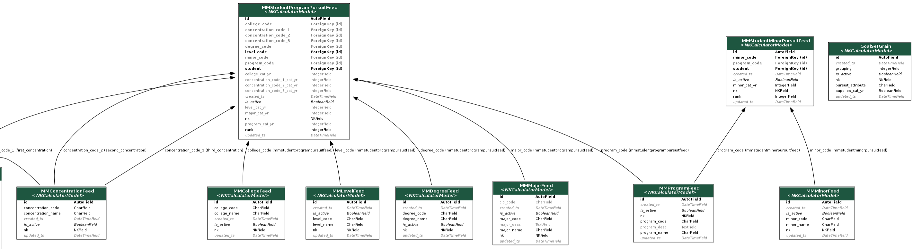

# Multimajor Orientation

Note:

This presentation is a primer on the multimajor/goalset approach that presumes no previous knowledge.

---

##### Objectives for now

Overview of

* what multimajor is for
* what we have done
* near term questions
* long term goals
* timelines

Note:

The big categories here are 1) why are we doing anything, 2) what are we doing, 3) what do we need to do.

---

##### Multimajor Objectives

Members have been clamoring for Navigate to gracefully support students having multiple objectives.  For example, students might double-major or have a major and a minor.  We currently don't do that.

Note:

Read the slide

---

##### What we have done

* Model Design
* Import Pipeline Build
* Rebuild of the AP page using REST

Note:

We've made progress on design, implementation, and feature development against the implementation.  We'll talk about that before working on next steps.

---

##### The Big Organizing Idea

Schools want students to have goals they can be working for, and we want to make templates for those.

But those goals might be in groups (goalsets) and vary by school.

So we need to give students 1+ goalsets, and those goalsets 1+ goals.

Note:

(Read the slide.)  The key things here are the configurability and 1+ matching.

---

---

##### But How Do We Get There?

So how do we populate those tables?

We have a bunch of MM.*Feed tables that DIS gives us, and we have a transformation pipeline.

---

---

##### What does this let us do?

Demo time.
